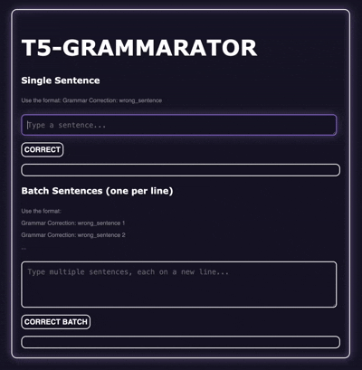

# README

**Fine-tuning Google’s T5 for Grammatical Error Correction (GEC) in sentences.**

# Table of Contents

- [About the Project](https://github.com/sarayusapa/T5-Grammarator/blob/main/README.md#about-the-project)
    - [Tech Stack](https://github.com/sarayusapa/T5-Grammarator/blob/main/README.md#tech-stack)
    - [Dataset](https://github.com/sarayusapa/T5-Grammarator/blob/main/README.md#dataset)
    - [File Structure](https://github.com/sarayusapa/T5-Grammarator/blob/main/README.md#file-structure)
- [Getting Started](https://github.com/sarayusapa/T5-Grammarator/blob/main/README.md#getting-started)
    - [Prerequisites](https://github.com/sarayusapa/T5-Grammarator/blob/main/README.md#prerequisites)
    - [Installation](https://github.com/sarayusapa/T5-Grammarator/blob/main/README.md#installation)
    - [Choose Model](https://github.com/sarayusapa/T5-Grammarator/blob/main/README.md#choose-model)
- [Usage](https://github.com/sarayusapa/T5-Grammarator/blob/main/README.md#usage)
    - [Start API Server](https://github.com/sarayusapa/T5-Grammarator/blob/main/README.md#start-api-server)
    - [Notes](https://github.com/sarayusapa/T5-Grammarator/blob/main/README.md#notes)
- [Reports & Documentation](https://github.com/sarayusapa/T5-Grammarator/blob/main/README.md#reports--documentation)
- [Future Work](https://github.com/sarayusapa/T5-Grammarator/blob/main/README.md#future-work)
- [Contributors](https://github.com/sarayusapa/T5-Grammarator/blob/main/README.md#contributors)
- [Acknowledgements](https://github.com/sarayusapa/T5-Grammarator/blob/main/README.md#acknowledgements)

# About The Project



This project provides a FastAPI-based service for Grammar Error Correction (GEC) using fine-tuned T5 models. We applied three different fine-tuning approaches (LoRA, QLoRA, and Full fine-tuning) and evaluate each method’s effectiveness in terms of performance, efficiency, and time and resource requirements.

## Tech Stack

- Programming Language: Python
- Deep Learning Framework: PyTorch
- Data Processing and Handling: Numpy, Pandas
- Model: Hugging Face Transformers
- Optimization: Optimum, ONNX Runtime
- Backend: FastAPI, Uvicorn
- Frontend: HTML, CSS, JS

## Dataset

We used a [Custom HF Dataset](https://huggingface.co/datasets/sarayusapa/Grammar_Error_Correction) of 200k sentence pairs which is a compilation of the following 2 datasets:

https://www.kaggle.com/datasets/satishgunjal/grammar-correction

https://bekushal.medium.com/cleaned-lang8-dataset-for-grammar-error-detection-79aaa31150aa

## File Structure

```
├─ app/                             # files for deployment and web app
├─ digit_recognition_nn/            # NN implementation code
├─ fine_tuning/                     # fine-tuning and evaluation code
└─ shakespeare_textgen/             # LSTM implementation code
├─ media/                           # images used in readme, report, blog
├─ biweekly_blog.md
├─ report.md
├─ README.md
```

# Getting Started

## Prerequisites

To install necessary libraries, run:

```bash
pip install transformers optimum[onnxruntime] torch fastapi uvicorn 
```

## Installation

Clone the repository

```bash
git clone https://github.com/sarayusapa/T5-Grammarator.git
```

## Choose Model

Navigate to the following directory:

```bash
cd T5-Grammarator/app/
```

You can run either the **Full Fine-Tuned model** or the **Adapter-based models (LoRA / QLoRA)**, depending on your preference.

### Option A: Full Fine-Tuned Model (default)

Run `convertmodel.py` as it is.

### Option B: Adapters (LoRA / QLoRA)

**Step 1**: In `convertmodel.py`, set:

```python
USE_ADAPTER = True
```

**Step 2**: In the same file, set:

```python
ADAPTER_PATH = "sarayusapa/T5_Large_GEC_LoRA"  #LoRA
```

 or

```python
 ADAPTER_PATH = sarayusapa/T5_Large_GEC_LoRA #QLoRA
```

**Step 3**: Run `convertmodel.py` to save the model in ONNX format.

# Usage

---

## Start API Server

In the same directory ("T5-Grammarator/app"), run the command:

```bash
uvicorn t5app:app --reload
```

After this, the server will be available to open and use.

## Notes

- Use **Full FT model** if you want the most accurate results.
- Use **Adapters (LoRA/QLoRA)** if you want lightweight and memory-efficient inference.

# Reports & Documentation

View the [Comparison Report](https://github.com/sarayusapa/T5-Grammarator/tree/main/report.md) analysing the performance of Full Fine-Tuning, LoRA, and QLoRA across parameters like efficiency, memory usage, and accuracy.

We also maintained a [Project Blog](https://github.com/sarayusapa/T5-Grammarator/tree/main/biweekly_blog.md) to document workflow, progress, results and decisions.

# Future Work

- Reinforcement Learning based fine-tuning for GEC+reasoning
- Probing methods to identify how attention heads imbibe grammar rules
- Finding ways to maximize quantization and maintaining accuracy

# Contributors

- [Sarayu Anantharaman](https://github.com/sarayusapa)
- [Hritaansh Mehra](https://github.com/Hritshhh)

# Acknowledgements

- [SRA VJTI](http://sra.vjti.info/),  Eklavya 2025
- Special thanks to our mentors, [Rakshitha](https://github.com/RakshithaKowlikar) and [Prithvi](https://github.com/rkt-1597).