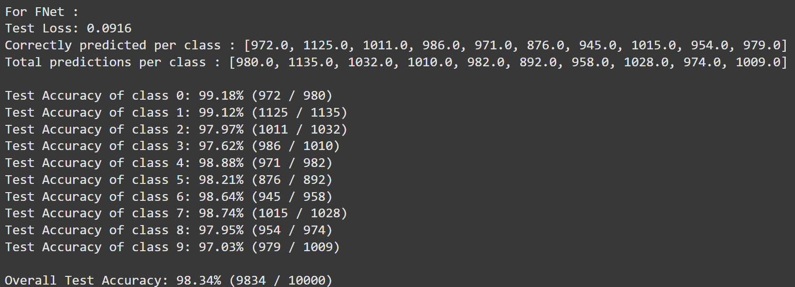
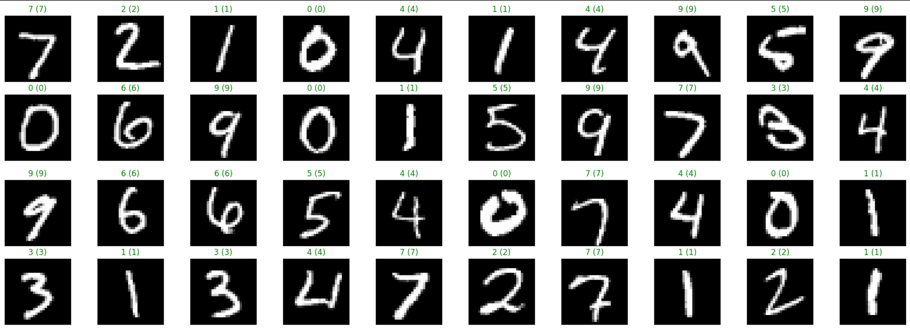
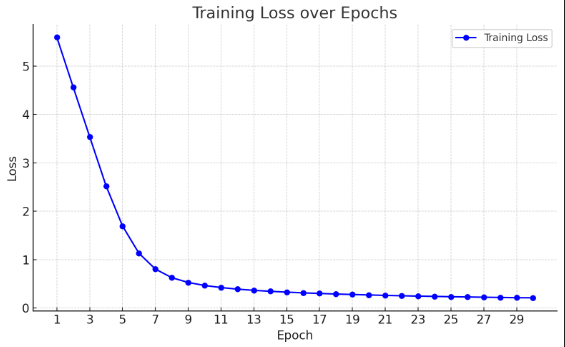
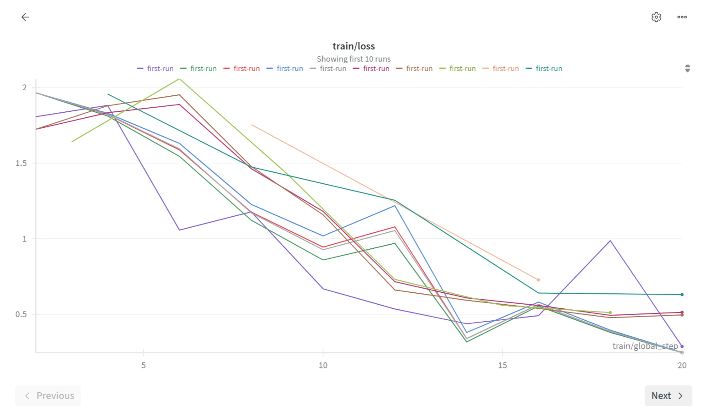
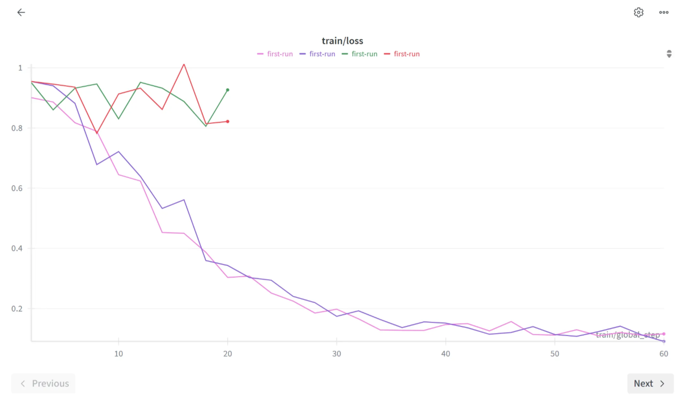
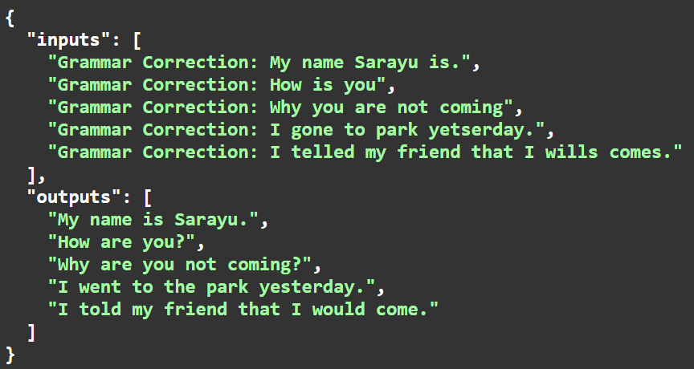

# Documenting Biweekly Progress Towards Completion 

# Introduction

The goal of this project is to fine tune Google’s T5 Transformer to perform GEC (Grammar Error Correction) on input text. 

# Week 1 & 2

## Progress

- Cleared our fundamentals and did a course on Neural Networks.
- Completed assignments as part of the course, practically applied what we learned.
- Browsed through a few datasets for fine tuning and shortlisted a few.

## Insights & Learnings

### Neural Networks

A Neural Network is a computational model inspired by the human brain. It consists of layers of interconnected nodes (neurons) that process input data to learn patterns and make predictions.

$$
z = wᵀx + b
$$

This is the linear combination used in a neural network.

- **x:** vector that represents the input data
- **w:** weight vector (vector representing weightage given to each unit of the input vector)
- **b:** bias (scalar quantity that shifts the activation function)
- **z:** the weighted sum before applying an activation function

### Loss and Cost Function

- Loss Function: Measures the difference between the predicted output and the actual target for one training example. It is given by the equation:

$$
L(y, \hat{y}) = - \big[ y \log(\hat{y}) + (1 - y) \log(1 - \hat{y}) \big]
$$

- Cost Function: The average of the loss function over the entire dataset. It is given by the equation:

$$
J(w, b) = \frac{1}{m} \sum_{i=1}^{m} L(\hat{y}^{(i)}, y^{(i)})
$$

- Goal: Minimize the cost by adjusting w and b. This will progressively increase the accuracy of the model’s outputs.

### Gradient Descent

An optimization algorithm that updates weights (w) and biases (b) step by step in the direction of the negative gradient of the cost function to minimize the cost function. The mathematical equation for gradient descent is given by:

$$
w := w - \alpha \, \frac{\partial J(w, b)}{\partial w}, b := b - \alpha \, \frac{\partial J(w, b)}{\partial b}
$$

$\alpha$ indicates Learning Rate.

### Activation Functions

Functions applied to ‘z’ that introduce non-linearity into the model, enabling neural networks to learn complex patterns. Examples:

- **Sigmoid:** outputs between 0 and 1 (used for binary classification)
- **ReLU (Rectified Linear Unit):** outputs 0 for negative values, linear for positive
- **tanh:** outputs between -1 and 1

### Forward and Back Propagation

- **Forward Propagation**: Inputs pass through the network  to produce an output.
- **Back Propagation**: The algorithm calculates the gradient of the cost function w.r.t. weights and biases (using the chain rule of differentiation), then updates them using gradient descent.

### Hyperparameters

External parameters set before training (not learned by the model) that control the learning process. Examples:
- Learning rate
- Number of layers / neurons
- Batch size
- Number of epochs
- Type of activation function

## Resources

[Neural Networks and Deep Learning (Course)](https://www.youtube.com/playlist?list=PLkDaE6sCZn6Ec-XTbcX1uRg2_u4xOEky0)

# Week 3 & 4

## Progress

- Did a course on Sequence Modelling
- Completed Assignments based on this course
- Built a Neural Network for Handwritten Digit Classification
- Studied the research paper on T5 and attention
- Finalised the datasets we will use for Fine Tuning

## Insights & Learnings

### Sequence Models

Sequence models are designed to handle data where order matters, such as text, speech, and time series.  At each time step t, the output may depend on both the current input $x_t$ and the previous history of inputs.

### Recurrent Neural Networks (RNNs)

RNNs are the simplest neural models for sequential data. They maintain a hidden state $h_t$ that is updated at each step using the current input and the previous hidden state. This recurrence allows the model to “remember” past information, but standard RNNs struggle with long-term dependencies.

### Vanishing and Exploding Gradients

When training RNNs, the gradients involve repeated multiplication of weight matrices. If the eigenvalues of these matrices are less than 1, gradients shrink exponentially (vanishing gradient); if greater than 1, they grow uncontrollably (exploding gradient).

This explains why vanilla RNNs fail to capture long-term dependencies. Gradient clipping is often used to control exploding gradients.

### LSTM and GRU

To overcome gradient problems, gated architectures were introduced.

**LSTM (Long Short-Term Memory)** is an advanced type of RNN.

- It introduces a cell state that acts like long-term memory and a set of gates (input, forget, output) to control the flow of information.
- This structure allows LSTMs to remember important information for long sequences while ignoring irrelevant details.

**GRU (Gated Recurrent Unit)** is simpler variant of LSTM.

- It combines the forget and input gates into a single update gate, and has a reset gate, but doesn’t have a separate cell state.
- GRUs have fewer parameters, making them faster to train.

### One-Hot Encoding (OHE) and Word Embeddings

In OHE, each word is represented as a sparse vector with one dimension set to 1. While simple, OHE does not capture similarity between words.

Word embeddings map words into dense, continuous vectors in a semantic space where similar words are close together. They are learned using models like Word2Vec, GloVe, or FastText.

### Beam Search

Beam search considers multiple alternatives instead of just one, using a parameter called the beam width. The algorithm keeps track of the top choices at each step and keeps narrowing down the possibilities.

### Attention Model

Seq2Seq models originally encoded the entire input into a single vector, which was limiting. Attention allows the decoder to “look back” at different encoder states when generating each token.

The context $c_t$ provides the decoder with a weighted combination of encoder states, enabling better handling of long inputs. Attention laid the foundation for the Transformer architecture.

## Models in Action
### Digit Classification Neural Network

We built this Neural Network using Pytorch as the deep learning framework and used the MNSIT library for our training and testing datasets.

### LSTM

We built an LSTM that generates Shakespearean style text when given a few words as input. We trained it on a text file containing excerpts from Shakespeare’s plays.

## Resources

[Sequence Models Complete Course](https://youtu.be/S7oA5C43Rbc?si=7GAuL81zxf7pZ_3d)

[Exploring the Limits of Transfer Learning with a Unified Text-to-Text Transformer](https://arxiv.org/abs/1910.10683)

[Attention is all you need](https://arxiv.org/abs/1706.03762)

# Week 5 & 6

## Progress

- Studied about fine tuning and it’s methods
- Started with test runs with QLoRA finetuning.
- Played around with Hyperparameter values to observe how the loss function changes.

## Insights & Learnings

To start out, we ran our fine tuning on Qwen2-0.5b (since it’s a lighter model). 

As you may observe, the loss function behaved differently with different values of Hyperparameters. Through trial and error, we got an idea of how to change up the hyperparameters to optimize the loss function.

We then switched to flan t5 and t5 base for test runs.

We eventually tuned our HPs for the optimal loss function, as shown. We hence set out to run complete QLoRA finetuning on our model, which would be trained on a 2.9M sentence compiled dataset.

## Problems encountered

Upon running inference QLoRA finetuned model, we encountered a recurring error where the model returned the same output as what was fed into it, thereby not correcting the sentence. 

We inferred that this could be because of:

1. Overfitting, abnormally low training loss function (<0.0001)
2. Extremely large dataset (not necessary for GEC) and many garbage values in the dataset.

We decided to clean up and scale down the size of the dataset and further change the hyperparameters.

## Resources

[LoRA: Low-Rank Adaptation of Large Language Models](https://arxiv.org/abs/2106.09685)

[QLoRA: Efficient Finetuning of Quantized LLMs](https://arxiv.org/abs/2305.14314)

[Parameter-Efficient Fine-Tuning Methods for Pretrained Language Models](https://arxiv.org/abs/2312.12148)

[GECToR -- Grammatical Error Correction: Tag, Not Rewrite](https://arxiv.org/abs/2005.12592)

# Week 7 & 8

## Progress

- Made a fresh dataset with relevant and less number of sentence pairs (200k)
- Ran QLoRA, LoRA and Full finetuning on T5 large, obtained 3 fine tuned models
- Conducted small inference runs on each model
- Evaluated each model’s performance on a 2k-sample dataset to compare results.
- Converted the best performing model into ONNX and deployed the ONNX model via FastAPI.
- Accounted for singular and batch endpoints
- Linked the API with a frontend
- Wrote a [comparison report](https://github.com/sarayusapa/T5-Grammarator/blob/main/report/report.md) on the three Fine Tuning methods, comparing accuracy, efficiency, etc.

## Insights & Learnings

| **Full FT** | **LoRA** | **QLoRA** |
|-------------|----------|-----------|
|  | | |
As shown, the evaluation scores for Full Fine Tuning are poorer than expected.
### Learnings
The full FT evaluation scores were lower than expected because SOS and EOS tokens were missing in training. This caused word jumbling and repetition, especially during evaluation. This however did not affect any results while running singular inference or even a few batches, while deploying the model.

## Models in Action

Batched-endpoints fed to FastAPI User Interface.

Final working frontend for the model.

# Conclusion and Future Goals

This project established a comparative study of 3 fine tuning methods and the trade-offs between efficiency, memory usage, and accuracy. The workflow also demonstrated the value of ONNX Runtime for deployment and the importance of systematic documentation throughout the process.

Future goals include:

- Exploring Reinforcement Learning–based fine-tuning to advance grammar correction and reasoning capabilities.
- Developing probing methods to analyze how attention heads encode grammatical rules.
- Investigating strategies to maximize quantization efficiency while preserving accuracy for deployment.
