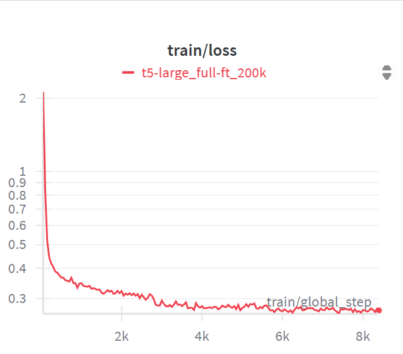
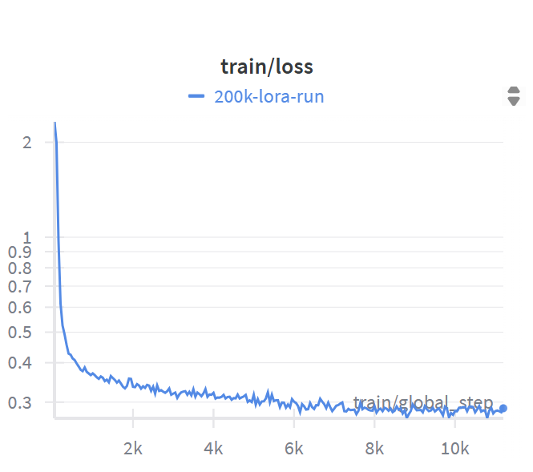
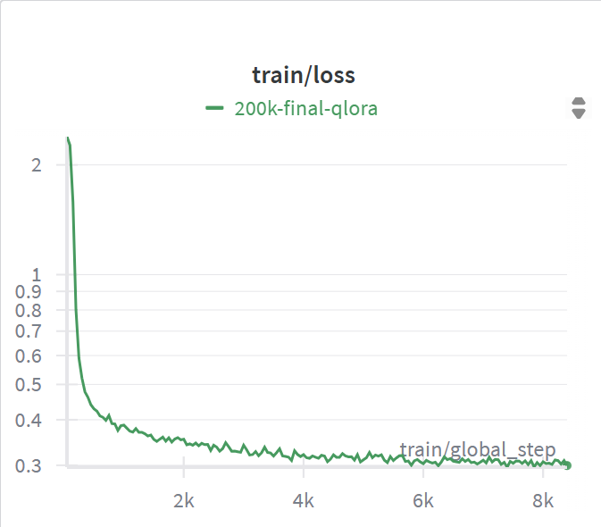
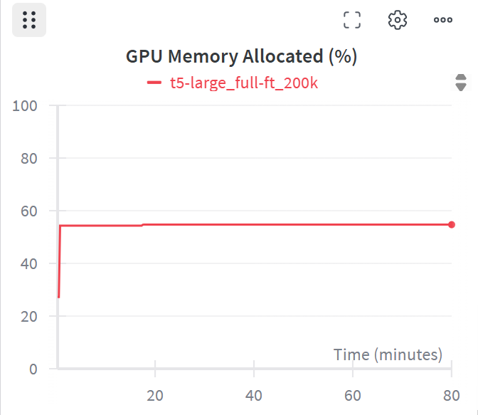
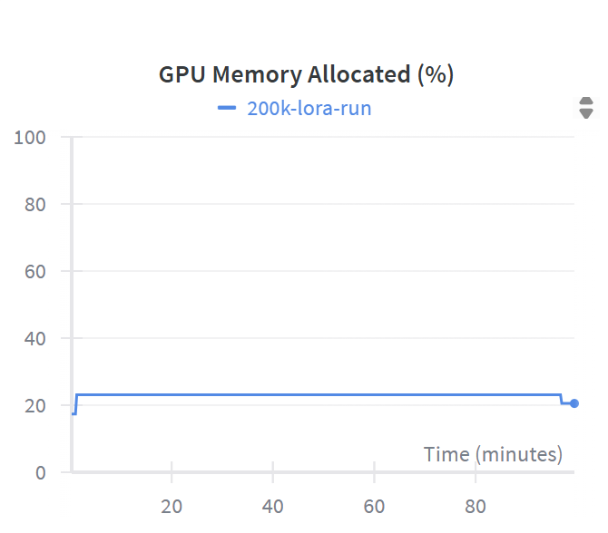
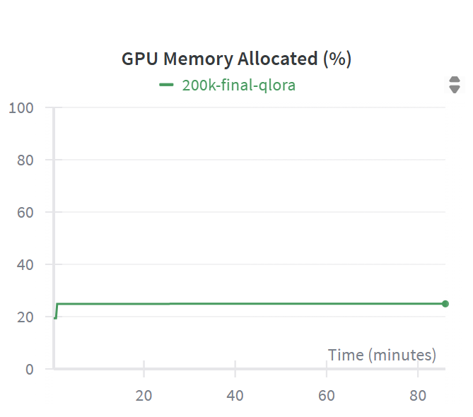
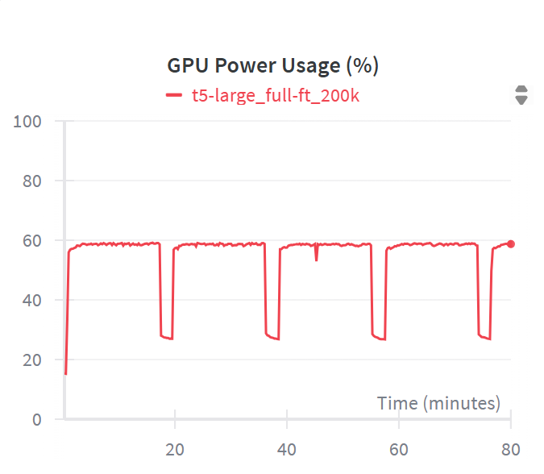
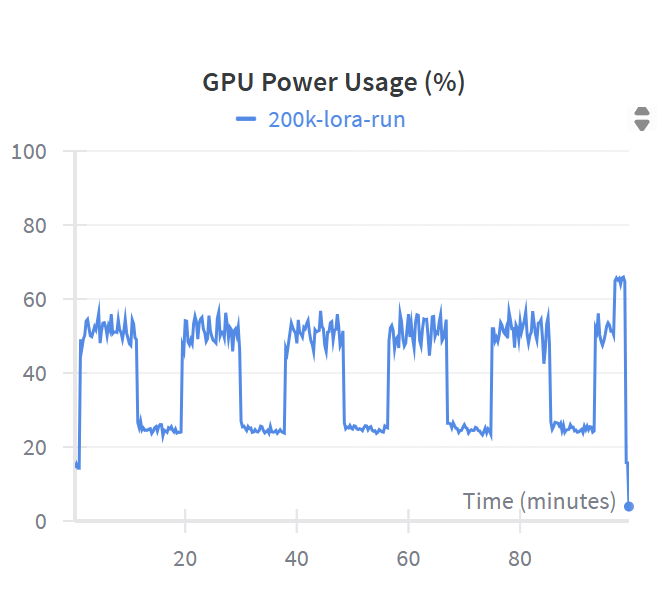
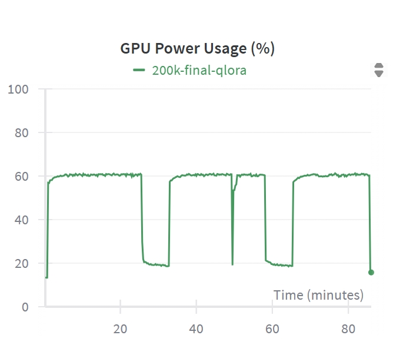

# Comparing LoRA, QLoRA and Full Fine Tuning Methods on GEC

# Abstract

Large language models and transformers such as T5-Large have demonstrated strong performance in natural language understanding and generation tasks. However, fine-tuning such models on downstream tasks can be computationally expensive and memory-intensive due to the large number of parameters. Parameter-efficient methods, such as LoRA and QLoRA, have been proposed to address these challenges by restricting updates to low-rank adapter matrices.

Our results show that Full fine-tuning provides the most nuanced and fluent corrections at higher computational cost, while LoRA and QLoRA, though far more efficient, achieve nearly comparable performance with some minor differences in phrasing and refinement.

# Introduction

This study investigates parameter-efficient fine-tuning methods for grammatical error correction (GEC) using T5-Large on a 200k-sentence dataset. Experiments were conducted on an NVIDIA RTX 4090, and both quantitative metrics and qualitative input-output examples were examined. We compare three approaches: full fine-tuning, LoRA, and QLoRA, analyzing their performance in terms of GLEU score, training efficiency and GPU/CPU usage. 

# Background

## Fine-Tuning of Pre-trained Models

Fine-tuning is a technique in adapting large pre-trained models to perform specific downstream tasks. Mathematically, it involves minimizing the average loss which is calculated over the entire dataset.

$$
\theta^* = \arg \min_{\theta} \mathbb{E}_{(x, y) \sim D} \left[ \mathcal{L}(\hat{y}, y) \right]
$$

where:

- $\theta$ represents the model parameters,
- $\hat{y}$ is the model's prediction for input $x$,
- $\mathcal{L}$ is the loss function (e.g., cross-entropy),
- $D$ is the dataset comprising input-output pairs $(x,y)$.

In the context of transformer like T5 and LLMs, fine-tuning entails adjusting all model parameters to minimize the task-specific loss. This process, while effective, is computationally intensive, especially as model sizes increase.

---

### Full Fine-Tuning

In Full Fine-Tuning, all parameters of the pre-trained model are updated during the epochs. Hence this requires storing gradients and optimizer states for each parameter, leading to substantial memory and computational demands. The update rule is:

$$
\theta \leftarrow \theta - \eta \nabla_{\theta} \mathcal{L}(\hat{y}, y)
$$

where $\eta$ is the learning rate. While this approach ensures maximum adaptability and performance, it is often impractical for very large models due to the extensive resources required.

---

### Low-Rank Adaptation (LoRA)

LoRA is a parameter-efficient method of fine tuning. It represents the weight matrix as a product of two smaller, low-rank matrices. Instead of updating the full weight matrix, LoRA introduces two trainable matrices $A \in \mathbb{R}^{d \times r}$  and $B \in \mathbb{R}^{r \times k}$, where $r$ is the rank, which is much smaller than $d$ and $k$. The final adapted weight becomes:

$$
W' = W + AB
$$

This approach freezes the pre-trained weights and only trains the matrices $A$ and $B$, significantly reducing the memory and computational requirements. Empirically, LoRA has been shown to perform almost on par with full fine-tuning in terms of task performance while being more efficient in terms of resources.

---

### Quantized LoRA (QLoRA)

QLoRA extends LoRA by incorporating quantization techniques to further reduce memory usage. It involves quantizing the pre-trained model weights to 4-bit precision using a data type called NormalFloat (NF4), which is optimized for normally distributed weights. The quantization process is followed by the introduction of LoRA adapters. The forward pass is:

$$
W' = \text{Dequantize}(W_q)  + AB
$$

where $W_q$ denotes the quantized weights. This technique enable the fine-tuning of large models on GPUs with limited memory.

---

# Comparing the 3 Methods

LoRA, QLoRA and Full Fine Tuning methods applied on Google’s T5-large transformer for the task of GEC, the comparison of these methods across various metrics provides insights into their relative efficiencies and performance.

## Trainable Parameters

Full FT: 770M (T5 Large)
LoRA: 8-10M (rank=8)
Empirical results from the LoRA and QLoRA method studies show that **r=8 provides a strong balance. It operates on** only around 1% trainable parameters of T5-Large while still nearly matching full fine-tuning performance across many NLP benchmarks.

## Learning Rate

| **Full FT** | **LoRA** | **QLoRA** |
| --- | --- | --- |
| 1e-4  | 2e-4 | 1e-4 |

Learning rate was chosen in accordance with the number of trainable parameters and noisy gradients. The more parameters are updated (Full Fine Tuning), or the noisier the gradients due to less precision (QLoRA), a smaller  LR was chosen. When only lightweight adapters are trained (e.g., LoRA), a larger LR is feasible for the model to converge faster.

## Warmup Ratio

**Warmup** refers to gradually increasing the learning rate at the start of training to stabilize optimization.

| **Full FT** | **LoRA** | **QLoRA** |
| --- | --- | --- |
| 0.02 | 0.05 | 0.05 |

For Full Fine Tuning, with a conservative learning rate applied to all parameters, a short warmup of 2% of training steps is sufficient.

In LoRA & QLoRA, the adapters require a longer warmup because their weights are initialized near zero and represent a small subspace within the model. A longer warmup allows the adapters to gradually align with the pretrained representations, ensuring stable convergence while still benefiting from a higher effective learning rate once fully warmed up.

## Loss Function

Using Wandb experiment tracking, the training loss graphs for each method are plotted.

| **Full FT** | **LoRA** | **QLoRA** |
|-------------|----------|-----------|
|  |  |  |

All three methods show a rapid drop initially followed by a steady drop. Full Fine Tuning and LoRA reach a lower loss (<0.3) while QLoRA plateaus above 0.3. This can be justified since quantization in QLoRA introduces relatively noisier gradients due to reduced precision. The lower learning rate in comparison with LoRA fine tuning also explains the higher value of loss after convergence. 

## Resource Expenditure

Using Wandb experiment tracking, the GPU utilization graphs for each method are plotted. 

### GPU Memory Allocation

| **Full FT** | **LoRA** | **QLoRA** |
|-------------|----------|-----------|
|  |  |  |

Full Fine-Tuning uses substantially more GPU memory (around 55% on a 4090) because all model weights, optimizer states, and activation checkpoints are accounted for. LoRA and QLoRA remain near 25% because LoRA freezes most weights and only stores a few adapter parameters, and QLoRA’s low-bit representation further reduces stored weight size. 

### GPU Power Usage

| **Full FT** | **LoRA** | **QLoRA** |
|-------------|----------|-----------|
|  |  |  |

Full FT power draw is high and periodically dips when GPU utilization drops. LoRA shows a noisy power profile as their utilization traces frequent short kernels and synchronization cause fast power oscillations. Since power responds rapidly to instantaneous load, any fragmentation of work (as in LoRA/QLoRA) is noisier even when the total energy consumed over an epoch is similar.

### Training Time

| **Full FT** | **LoRA** | **QLoRA** |
| --- | --- | --- |
| 2.5 hours | 1.5 hours | 1.5 hours |

LoRA and QLoRA update only a small set of adapter parameters (LoRA) or using lower-precision kernels (QLoRA) reducing per-step compute time. This yields faster steps and fewer stalls. Full parameter training performs larger forward and and backward passes, increasing step time and aggregate training time. 

## Example-wise Comparison of the 3 Methods

To better understand where the methods diverge, tabulated below are two input sentences and compared the corrected outputs from Full Fine Tuning, LoRA, and QLoRA. 

| Wrong Sentence | QLoRA | LoRA | Full Fine Tuning |
| --- | --- | --- | --- |
| She don't went to the market because her friends was telling her that the shops closes early and she forgoted her wallet at home. | She *didn't* go to the market because her friends were telling her that the shops close early and she forgot her wallet at home. | She *did not* go to the market because her friends were telling her that the shops close early and she forgot her wallet at home. | She *didn't* go to the market because her friends were telling her that the shops close early and she forgot her wallet at home. |
| The childrens that plays in the garden has broken the fence and any of them don’t know who did it. | The children that play in the garden have broken the fence and *none of them* know who did it. | The children that play in the garden have broken the fence and *none of them* know who did it. | The children that play in the garden have broken the fence and *no one* knows who did it. |

### Observation

Across both examples, all three models corrected major grammar errors such as: 

- verb tense (“don’t went” → “didn’t go”)
- subject–verb agreement (“was” → “were”)
- plural forms (“childrens” → “children”)

Full fine-tuning produced the most natural and fluent corrections, often preferring contractions and more idiomatic phrasing (e.g., “no one knows” instead of “none of them know”). 

LoRA was almost identical to Full in accuracy, differing slightly in style (more formal expansions like “did not”). QLoRA corrected the main errors but sometimes left less polished phrasing, showing a tendency toward minimal correction.

### Inference

The results suggest that while QLoRA is effective at handling obvious grammatical mistakes, its quantization limits subtle refinements, leading to less natural phrasing. LoRA achieves near-Full performance with only minor stylistic differences, demonstrating that adapter tuning can preserve high correction quality with reduced compute. Full fine-tuning, however, remains the strongest in terms of fluency and idiomatic language, reflecting the benefits of updating all parameters.

# Conclusion

Full fine-tuning achieves the most nuanced and fluent corrections. This advantage, however, comes with higher computational cost in both memory and training time. LoRA and QLoRA methods are more efficient, perform almost up to the mark, consistently correcting major grammatical errors and producing outputs close to Full fine-tuning, with only minor differences in phrasing or subtle refinements. This makes them good practical alternatives when efficiency is a priority.
