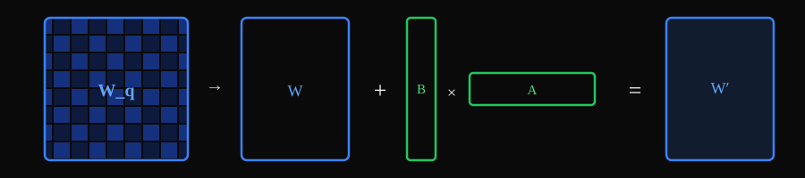
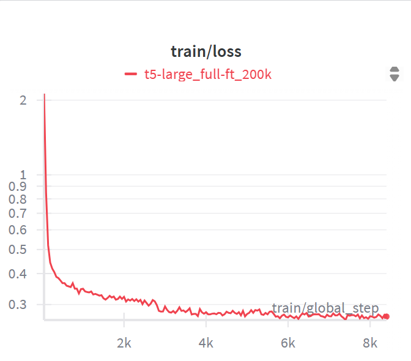
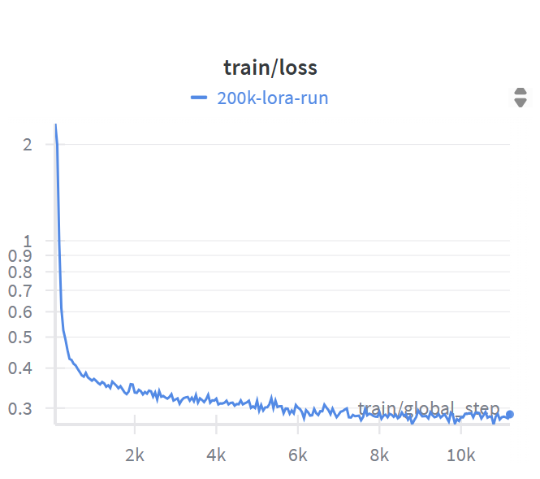
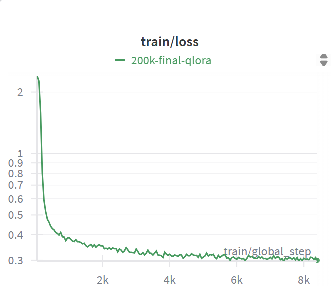
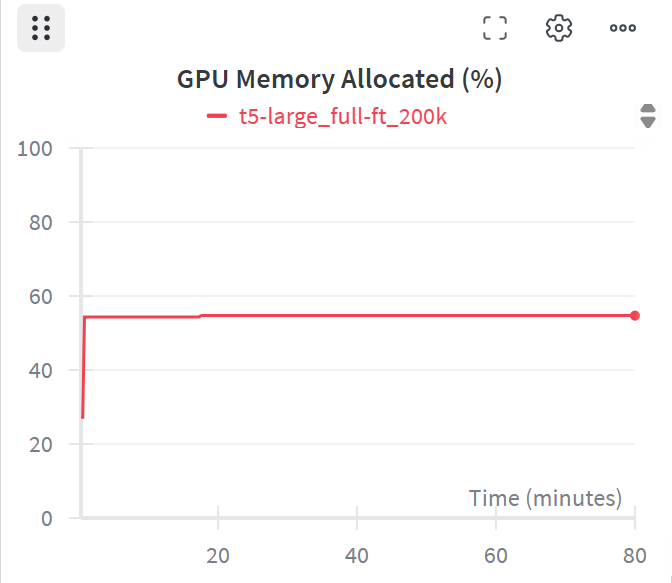
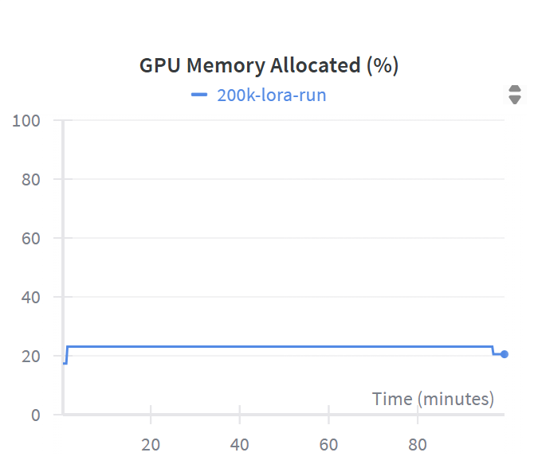
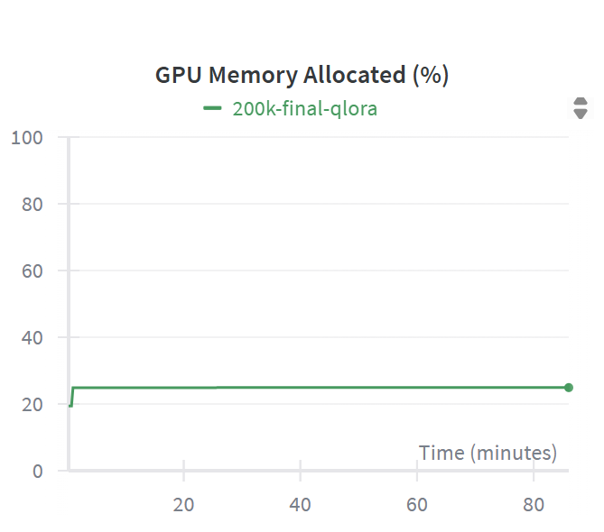
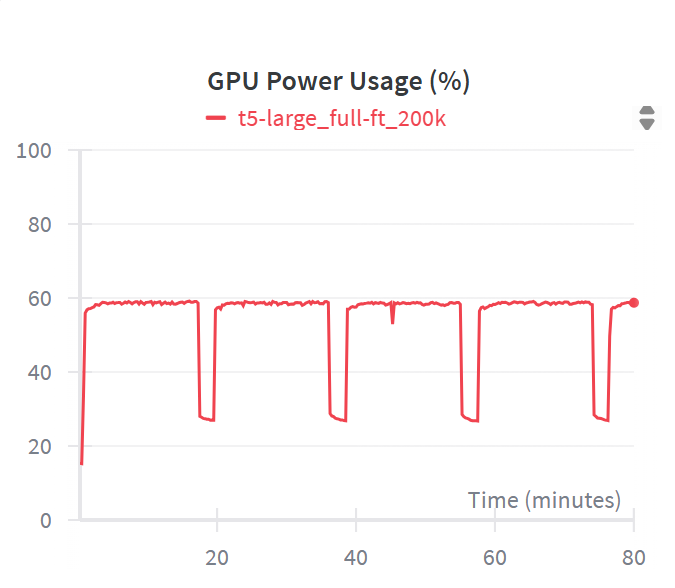
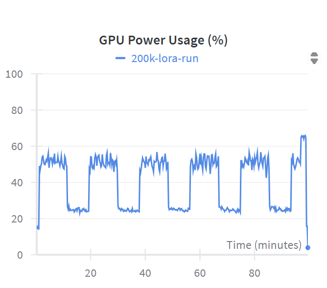
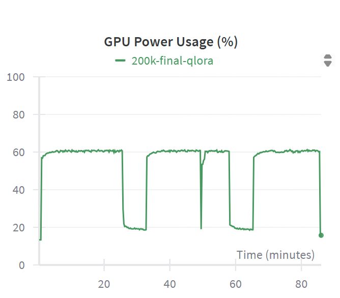

# Comparing LoRA, QLoRA and Full Fine Tuning Methods on GEC

# Abstract

Large language models and transformers such as T5-Large have demonstrated strong performance in natural language understanding and generation tasks. However, fine-tuning such models on downstream tasks can be computationally expensive and memory-intensive due to the large number of parameters. Parameter-efficient methods, such as LoRA and QLoRA, have been proposed to address these challenges by restricting updates to low-rank adapter matrices.

Our results show that Full Fine-Tuning comes out ahead on both benchmarks tested here (JFLEG GLEU and BEA-2019-dev F0.5), but the margin over LoRA and QLoRA is small and concentrated in a handful of structurally demanding error types such as word order. On well-defined categories like subject-verb agreement and determiners, all three methods perform about the same, at a fraction of the computational cost for LoRA and QLoRA.

# Introduction

This study investigates parameter-efficient fine-tuning methods for grammatical error correction (GEC) using T5-Large on a 200k-sentence dataset. Experiments were conducted on an NVIDIA RTX 4090. We compare three approaches (full fine-tuning, LoRA, and QLoRA), analyzing their performance in terms of training efficiency, GPU/CPU usage, and accuracy on two public GEC benchmarks (JFLEG, BEA-2019-dev), including a breakdown by grammatical error type.

# Background

## Fine-Tuning of Pre-trained Models

Fine-tuning is a technique in adapting large pre-trained models to perform specific downstream tasks. Mathematically, it involves minimizing the average loss which is calculated over the entire dataset.

$$
\theta^* = \arg \min_{\theta} \mathbb{E}_{(x, y) \sim D} \left[ \mathcal{L}(\hat{y}, y) \right]
$$

where:

- $\theta$ represents the model parameters,
- $\hat{y}$ is the model's prediction for input $x$,
- $\mathcal{L}$ is the loss function (e.g., cross-entropy),
- $D$ is the dataset comprising input-output pairs $(x,y)$.

In the context of a transformer like T5 or an LLM, fine-tuning entails adjusting all model parameters to minimize the task-specific loss. This process, while effective, is computationally intensive, especially as model sizes increase.

---

### Full Fine-Tuning

In Full Fine-Tuning, all parameters of the pre-trained model are updated during the epochs. Hence this requires storing gradients and optimizer states for each parameter, leading to substantial memory and computational demands. The update rule is:

$$
\theta \leftarrow \theta - \eta \nabla_{\theta} \mathcal{L}(\hat{y}, y)
$$

where $\eta$ is the learning rate. While this approach ensures maximum adaptability and performance, it is often impractical for very large models due to the extensive resources required.

---

### Low-Rank Adaptation (LoRA)

LoRA is a parameter-efficient method of fine tuning. It represents the weight matrix as a product of two smaller, low-rank matrices. Instead of updating the full weight matrix, LoRA introduces two trainable matrices $A \in \mathbb{R}^{d \times r}$  and $B \in \mathbb{R}^{r \times k}$, where $r$ is the rank, which is much smaller than $d$ and $k$. The final adapted weight becomes:

$$
W' = W + AB
$$

This approach freezes the pre-trained weights and only trains the matrices $A$ and $B$, significantly reducing the memory and computational requirements. Empirically, LoRA has been shown to perform almost on par with full fine-tuning in terms of task performance while being more efficient in terms of resources.

---

### Quantized LoRA (QLoRA)

QLoRA extends LoRA by incorporating quantization techniques to further reduce memory usage. It involves quantizing the pre-trained model weights to 4-bit precision using a data type called NormalFloat (NF4), which is optimized for normally distributed weights. The quantization process is followed by the introduction of LoRA adapters. The forward pass is:

$$
W' = \text{Dequantize}(W_q)  + AB
$$

where $W_q$ denotes the quantized weights. This technique enable the fine-tuning of large models on GPUs with limited memory.

## Why LoRA, QLoRA, and Full Fine-Tuning for GEC

GEC as a task calls for precise changes in the sentence while preserving most of its original structure. 

Several fine-tuning methods exist, including adapters, prefix tuning, prompt tuning, LoRA, QLoRA, and full fine-tuning. Each has demonstrated success in certain applications, but for GEC, LoRA, QLoRA, and Full Fine-Tuning consistently outperform the others. 

### Full Fine-Tuning: Maximising Representational Capacity

Full fine-tuning, as mentioned, updates all parameters of the pretrained model. This helps the model learn a new function across its entire parameter space, reorganizing both high-level semantic knowledge and low-level syntactic sensitivities to optimize for GEC. For GEC, where grammar rules can involve long-range dependencies, this flexibility is valuable. 

The drawback is that fine-tuning billions of parameters requires substantial compute, memory, and storage. 

### LoRA: Adds Efficiency, Maintains Accuracy

LoRA (Low-Rank Adaptation) addresses the inefficiency of full fine-tuning by restricting parameter updates to a low-rank subspace. Importantly, LoRA injects adapter weight updates into the **attention layers** of the pretrained model.

This is helpful as grammar errors often depend on attention-based relations between tokens. By modifying the attention matrices directly, LoRA effectively teaches the model to attend differently to different tokens, without needing to rewrite the entire network. 

### QLoRA: Scaling to Larger Models

Training very large base models is computationally expensive. QLoRA extends LoRA by quantizing the base model to 4-bit precision, keeping it frozen, and applying LoRA adapters on top. One might expect this to harm accuracy, but because the **LoRA adapters remain in full precision**, they can compensate for much of the quantization loss. The result is a system that is both memory-efficient and expressive.

# Comparing the 3 Methods

LoRA, QLoRA, and Full Fine-Tuning were applied to Google's T5-Large transformer for the task of GEC. Comparing these methods across the metrics below provides insight into their relative efficiency and performance.

## Trainable Parameters

| **Full FT** | **LoRA** | **QLoRA** |
| --- | --- | --- |
| 770M (100%) | 4.7M (0.64%) | 2.4M (0.32%) |

LoRA and QLoRA both use rank r=8 adapters, but LoRA injects them into all four attention projections (query, key, value, output) while QLoRA targets only query and value, halving its adapter parameter count relative to LoRA. Both stay well under 1% of T5-Large's parameters while nearly matching full fine-tuning performance, consistent with the original LoRA and QLoRA papers [1, 2].

## Learning Rate

| **Full FT** | **LoRA** | **QLoRA** |
| --- | --- | --- |
| 1e-4  | 2e-4 | 1e-4 |

Learning rate was chosen in accordance with the number of trainable parameters and noisy gradients. The more parameters are updated (Full Fine-Tuning), or the noisier the gradients due to less precision (QLoRA), the smaller the LR chosen. When only lightweight adapters are trained (e.g., LoRA), a larger LR is feasible for the model to converge faster.

## Warmup Ratio

**Warmup** refers to gradually increasing the learning rate at the start of training to stabilize optimization.

| **Full FT** | **LoRA** | **QLoRA** |
| --- | --- | --- |
| 0.02 | 0.05 | 0.05 |

For Full Fine-Tuning, with a conservative learning rate applied to all parameters, a short warmup of 2% of training steps is sufficient.

In LoRA & QLoRA, the adapters require a longer warmup because their weights are initialized near zero and represent a small subspace within the model. A longer warmup allows the adapters to gradually align with the pretrained representations, ensuring stable convergence while still benefiting from a higher effective learning rate once fully warmed up.

## Loss Function

Using Wandb experiment tracking, the training loss graphs for each method are plotted.

| **Full FT** | **LoRA** | **QLoRA** |
|-------------|----------|-----------|
|  |  |  |

All three methods show a rapid drop initially followed by a steady decline. Full Fine-Tuning and LoRA reach a lower loss (<0.3) while QLoRA plateaus above 0.3. This can be explained by quantization in QLoRA introducing noisier gradients due to reduced precision. The lower learning rate relative to LoRA also explains the higher loss after convergence. 

## Resource Expenditure

Using Wandb experiment tracking, the GPU utilization graphs for each method are plotted. 

### GPU Memory Allocation

| **Full FT** | **LoRA** | **QLoRA** |
|-------------|----------|-----------|
|  |  |  |

Full Fine-Tuning uses substantially more GPU memory (around 55% on a 4090) because all model weights, optimizer states, and activation checkpoints are accounted for. LoRA and QLoRA remain near 25% because LoRA freezes most weights and only stores a few adapter parameters, and QLoRA’s low-bit representation further reduces stored weight size. 

### GPU Power Usage

| **Full FT** | **LoRA** | **QLoRA** |
|-------------|----------|-----------|
|  |  |  |

Full FT power draw is high and periodically dips when GPU utilization drops. LoRA and QLoRA show a noisier power profile: their utilization traces frequent short kernels, and synchronization causes fast power oscillations. Since power responds rapidly to instantaneous load, any fragmentation of work (as in LoRA/QLoRA) is noisier even when the total energy consumed over an epoch is similar.

### Training Time

| **Full FT** | **LoRA** | **QLoRA** |
| --- | --- | --- |
| 2.5 hours | 1.5 hours | 1.5 hours |

LoRA and QLoRA update only a small set of adapter parameters (LoRA) or use lower-precision kernels (QLoRA), reducing per-step compute time. This yields faster steps and fewer stalls. Full parameter training performs larger forward and backward passes, increasing step time and aggregate training time. 

## Evaluation Metrics

This section reports results on two public GEC benchmarks: 
- [JFLEG](https://huggingface.co/datasets/jhu-clsp/jfleg) (fluency-focused, scored with corpus GLEU against 4 references per sentence) 
- [BEA-2019](https://www.cl.cam.ac.uk/research/nl/bea2019st/) dev set (W&I+LOCNESS, scored with [ERRANT](https://github.com/chrisjbryant/errant) edit-based precision/recall/F0.5, the standard GEC scoring approach, which aligns hypothesis edits against gold edits rather than requiring an exact match). 

Both benchmarks were generated with beam search and repetition blocking, the same decoding behavior as the deployed API.

| Model | JFLEG GLEU | BEA-2019-dev Precision | BEA-2019-dev Recall | BEA-2019-dev F0.5 |
|---|---|---|---|---|
| Full FT | **0.665** | **0.196** | 0.302 | **0.210** |
| LoRA | 0.642 | 0.172 | **0.303** | 0.188 |
| QLoRA | 0.638 | 0.167 | 0.288 | 0.183 |

Full Fine-Tuning scores best on both benchmarks, followed by LoRA, then QLoRA. This matches the theoretical expectation that full-parameter updates carry the most representational capacity, with LoRA close behind and QLoRA trading a little more accuracy for its lower memory footprint (see [Comparing the 3 Methods](#comparing-the-3-methods)).

The absolute BEA-2019-dev scores (F0.5 ≈ 0.18–0.21) sit well below published leaderboard results, where state-of-the-art systems reach F0.5 > 0.7. BEA-2019 is drawn from L2-learner essays, while this project's training data (the Kaggle grammar-correction set plus cleaned Lang-8) skews toward shorter, more synthetic error patterns, and none of these models were trained or tuned for the BEA-2019 distribution specifically. That domain gap, not a weakness in any one method, accounts for most of the difference from published leaderboard numbers.

## Error-Type Behavior Analysis

The aggregate BEA-2019-dev numbers in [Evaluation Metrics](#evaluation-metrics) say Full FT scores highest overall, but that single F0.5 number hides *where* each method actually wins or loses. ERRANT classifies every edit by grammatical error type, so the same BEA-2019-dev predictions used above can be broken down by category to see which kinds of corrections each method is actually good at, rather than relying on a couple of hand-picked sentences.

| Error Category | Full FT F0.5 | LoRA F0.5 | QLoRA F0.5 |
| --- | --- | --- | --- |
| VERB:SVA (subject–verb agreement) | 0.649 | 0.647 | 0.647 |
| DET (determiners) | 0.526 | 0.519 | 0.523 |
| PREP (prepositions) | 0.512 | 0.518 | 0.510 |
| VERB:FORM | 0.553 | 0.560 | 0.563 |
| VERB:TENSE | 0.503 | 0.497 | 0.492 |
| NOUN:NUM (singular/plural) | 0.532 | 0.506 | 0.487 |
| SPELL | 0.565 | 0.563 | 0.540 |
| MORPH | 0.548 | 0.526 | 0.507 |
| WO (word order) | 0.369 | 0.337 | 0.331 |
| PUNCT | 0.096 | 0.090 | 0.081 |
| ORTH (spacing/capitalization) | 0.017 | 0.014 | 0.013 |
| CONTR (contractions) | 0.045 | 0.037 | 0.039 |

On the well-defined, morphology-driven categories (subject-verb agreement, determiners, prepositions, verb tense and form), all three methods land within the same F0.5 ≈ 0.49–0.65 range, and the gaps between them are within noise. This is the bulk of what the training data (Kaggle grammar-correction plus cleaned Lang-8) actually teaches, and all three methods picked it up about equally well.

Full FT's overall lead comes almost entirely from two categories rather than a uniform gap across the board: word order (0.369 versus 0.337 and 0.331) and morphological inflection (MORPH, NOUN:NUM), where it stays clearly ahead of LoRA and QLoRA. Both involve restructuring a sentence rather than swapping one token for another, which fits the idea that updating the full parameter space, not just the attention projections, matters most for edits that touch broader sentence structure. On a few other categories, like verb form and prepositions, LoRA or QLoRA edge ahead instead, so the aggregate ranking comes down to a handful of specific error types rather than a consistent quality gap.

PUNCT, ORTH, and CONTR are the weak point for every method (F0.5 under 0.1, with false positives outnumbering true positives by 10 to 100 times), and this looks more like a benchmark artifact than a model weakness. BEA-2019's source sentences come pre-tokenized with spaces around every token ("do n't" instead of "don't"), a format none of the three training runs ever saw, since the Kaggle and Lang-8 training data is natural, untokenized text. All three models spend edits normalizing this formatting, and ERRANT counts those against gold annotations that never touch spacing at all. Since it affects every method equally, it doesn't change the ranking between them, but it does mean the low PUNCT/ORTH/CONTR scores reflect a tokenization mismatch between training and evaluation data rather than an inability to handle punctuation.

# Conclusion

Full Fine-Tuning scores highest of the three methods on both JFLEG GLEU and BEA-2019-dev F0.5, with its lead coming mainly from word order and morphological inflection rather than a uniform gap across every error type. That advantage comes with a higher computational cost in both memory and training time. LoRA and QLoRA are far more efficient, land within a few points of Full Fine-Tuning on both benchmarks, and are statistically indistinguishable from it on well-defined categories like subject-verb agreement, determiners, and prepositions. That makes them practical alternatives whenever the correction task doesn't lean heavily on structural rewrites.

# References

1. Hu, E. J., Shen, Y., Wallis, P., Allen-Zhu, Z., Li, Y., Wang, S., Wang, L., & Chen, W. (2021). *LoRA: Low-Rank Adaptation of Large Language Models*. [arXiv:2106.09796](https://arxiv.org/abs/2106.09796)
2. Dettmers, T., Pagnoni, A., Holtzman, A., & Zettlemoyer, L. (2023). *QLoRA: Efficient Finetuning of Quantized LLMs*. [arXiv:2305.14314](https://arxiv.org/abs/2305.14314)
3. Napoles, C., Sakaguchi, K., & Tetreault, J. (2017). *JFLEG: A Fluency Corpus and Benchmark for Grammatical Error Correction*. EACL. [Dataset](https://huggingface.co/datasets/jhu-clsp/jfleg)
4. Bryant, C., Felice, M., Andersen, Ø. E., & Briscoe, T. (2019). *The BEA-2019 Shared Task on Grammatical Error Correction*. BEA Workshop. [Data](https://www.cl.cam.ac.uk/research/nl/bea2019st/)
5. Bryant, C., Felice, M., & Briscoe, T. (2017). *Automatic Annotation and Evaluation of Error Types for Grammatical Error Correction*. ACL. [ERRANT](https://github.com/chrisjbryant/errant)
